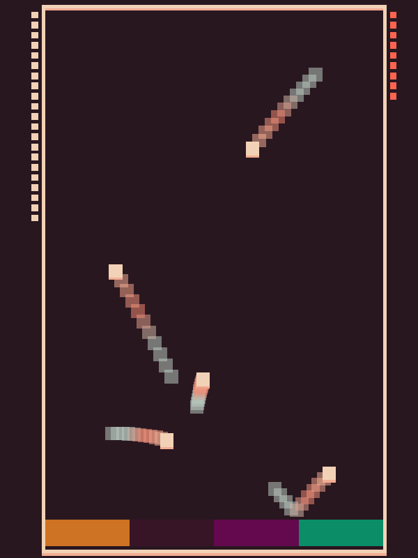

# Bing Bong Pong

Author: Anne He

Design: A chaotic game about bouncy balls. Press the correct key at the correct time to bounce the balls, otherwise they fall into the abyss. The keys make fun sounds for maximum chaos. The more points you score the more balls appear. How many balls can you juggle?

Screen Shot:

How To Play:

ASDF to activate the not-paddles. You have 10 lives shown on the right. You lose lives by dropping balls. When you lose all lives and drop your last ball, the game ends. Your score displays on the left.

Sources: Used https://github.com/15-466/15-466-f21-base0 source code, and ideas from the 15-466 Timing lesson. Sounds sampled from https://freesound.org/people/Timbre/sounds/232210/.

This game was built with [NEST](NEST.md).
